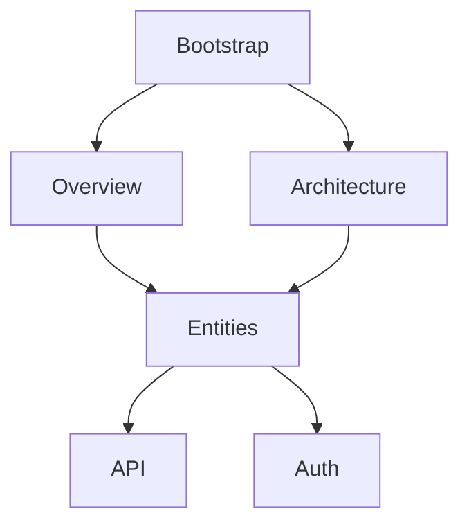

# Analisi della Metodologia Agentica di RepoSpecZero

**Data**: 19 Gennaio 2026
**Autore**: Claude (Analisi metodologica)
**Fonte**: Cartella `vault/specs/` del progetto opencode-plugin-repo-spec-zero

---

## 1. CONCETTO FONDAMENTALE

### 1.1 Filosofia: Da Algoritmico a Genetico

La metodologia agentica rappresenta un **cambio di paradigma radicale**: il passaggio da un approccio **algoritmico** (logica hardcoded in TypeScript) a uno **genetico/delegato** (orchestrazione basata su agenti LLM).

**Principio chiave**: Invece di scrivere codice che "sa" cosa fare, si scrivono specifiche che "dicono" a degli agenti cosa devono fare. L'intelligenza non è più nel codice ma nei prompt e nella struttura delle delegazioni.

### 1.2 Vision

Trasformare RepoSpecZero in un **orchestratore agentico intelligente** dove ogni fase dell'analisi è:
- **Delegata** → Ogni task è eseguito da un agente specializzato
- **Tracciata** → Ogni step produce artefatti persistenti in `_meta/`
- **Componibile** → Gli agenti possono essere combinati e riordinati

### 1.3 Il Paradigm Shift

| Aspetto | Prima (v2.1.x) | Dopo (v3.0.0) |
|---------|----------------|---------------|
| DAG Planning | Algoritmo TypeScript hardcoded | Agent LLM-based con output .md |
| Execution | Promise.all in DAGExecutor.ts | Serie di /task delegati |
| Context | In-memory SharedContext | File system `_meta/` |
| Traceability | Log monolitico | File separati per ogni node |
| Debugging | Stack trace + grep | File `.md` self-contained |
| Model Control | Singolo modello | Modello specifico per node |
| Resumability | Restart da zero | Resume da ultimo node fallito |

---

## 2. STRUTTURA ARCHITETTURALE

### 2.1 L'Architettura a 5 Fasi

L'intero flusso è organizzato in **5 step sequenziali**, ognuno gestito da un componente specializzato:

```
┌──────────────────────────────────────────────────────────────────┐
│                    FLUSSO AGENTICO IN 5 STEP                      │
└──────────────────────────────────────────────────────────────────┘

  ┌─────────────┐      ┌─────────────┐      ┌─────────────┐
  │   STEP 1    │ ───▶ │   STEP 2    │ ───▶ │   STEP 3    │
  │  Analyzer   │      │ DAG Planner │      │Node Creator │
  │   (~45s)    │      │   (~30s)    │      │   (~60s)    │
  └─────────────┘      └─────────────┘      └─────────────┘
        │                    │                    │
        ▼                    ▼                    ▼
  00-overview.md       01-dag.md          02-nodes/*.md
        │                    │                    │
        └────────────────────┴────────────────────┘
                             │
                             ▼
  ┌─────────────┐      ┌─────────────────────────────────┐
  │   STEP 4    │ ───▶ │           STEP 5                │
  │  Prepare    │      │     Execution Layer-by-Layer    │
  │  Todo List  │      │      (parallelismo intra-layer) │
  └─────────────┘      └─────────────────────────────────┘
        │                    │
        ▼                    ▼
   Todo Widget         _generated/*.md + logs + summaries
```

### 2.2 La Directory `_meta/` - Il "Cervello Persistente"

La struttura `_meta/` rappresenta la **memoria di processo** dell'orchestrazione:

```
_meta/
├── 00-overview.md          # Analisi iniziale del repo
├── 01-dag.md               # Piano DAG con dipendenze
├── 02-nodes/               # Specifiche di ogni nodo
│   ├── node-001-bootstrap.md
│   ├── node-002-overview.md
│   └── ...
├── logs/                   # Log di esecuzione per nodo
│   ├── orchestrator.log
│   ├── node-001-bootstrap.log
│   └── ...
├── cache/                  # Summaries per dependency injection
│   ├── summary-bootstrap.md
│   ├── summary-overview.md
│   └── ...
├── state.json              # Stato dell'orchestrator (per resume)
└── manifest.json           # Metadata finali dell'esecuzione
```

**Vantaggi della persistenza**:
- Debug semplificato (ogni file è self-contained)
- Resumability (ripresa da ultimo nodo fallito)
- Audit trail completo
- Context window dell'agente principale rimane leggero

### 2.3 Layer Structure e Parallelismo

I nodi sono organizzati in **layer** per rispettare le dipendenze:

```
Layer 0: Bootstrap
    └── Nodi fondazionali senza dipendenze

Layer 1: Foundation
    └── Overview, Architecture (dipendono da Bootstrap)

Layer 2: Domain
    └── Entities, Modules (dipendono da Foundation)

Layer 3: Details
    └── API, Auth, Data (dipendono da Domain)

Layer 4: Ops
    └── ML, Monitoring, Flags (dipendono da vari layer)

Layer 5: Summary
    └── Finalizers (dipendono da tutti i layer precedenti)
```

**Regola di esecuzione**: Tutti i nodi dello stesso layer vengono eseguiti **in parallelo** (Promise.all), poi si procede al layer successivo.

---

## 3. GLI AGENTI COINVOLTI

### 3.1 Orchestrator Agent (Agente Principale)

**Ruolo**: Coordinatore centrale, esegue la state machine in 5 step.

**Responsabilità**:
- Inizializzazione struttura `_meta/`
- Delegazione ai sub-agent via `/task`
- Gestione sequenzialità step1→step2→step3→step4→step5
- Gestione parallelismo intra-layer nello step 5
- Aggiornamento todo list real-time
- Persistenza stato in `state.json`
- Error handling e retry logic

**State Machine**:
```
idle → analyzing → planning → creating_nodes → preparing → executing → finalizing → completed
                                                                    └── failed (in caso di errore)
```

### 3.2 Analyzer Agent (T-040)

**Ruolo**: Analisi iniziale del repository.

**Input**: Path del repository da analizzare

**Output**: `00-overview.md` contenente:
- Tech stack rilevato
- Tipo di progetto
- Features chiave (API, Auth, DB, etc.)
- File principali identificati
- Raccomandazioni per l'analisi

**Caratteristiche**:
- Prima fase, nessuna dipendenza
- Legge la struttura file e sample di codice
- Produce un documento strutturato per guidare le fasi successive

### 3.3 DAG Planner Agent (T-043)

**Ruolo**: Generazione del piano di esecuzione come DAG (Directed Acyclic Graph).

**Input**: `00-overview.md` (output dell'Analyzer)

**Output**: `01-dag.md` contenente:
- Diagramma Mermaid del DAG
- Lista nodi con dipendenze
- Assegnazione ai layer
- Metadata per ogni nodo (priorità, opzionalità)

**Formato output**:


### 3.4 Node Creator Agent (T-046)

**Ruolo**: Generazione delle specifiche dettagliate per ogni nodo del DAG.

**Input**:
- `01-dag.md` (DAG plan)
- `00-overview.md` (context del repo)

**Output**: Directory `02-nodes/` con file `.md` per ogni nodo:
```
02-nodes/
├── node-001-bootstrap.md
├── node-002-overview.md
├── node-003-architecture.md
├── node-004-entities.md
└── ...
```

**Ogni Node Spec contiene**:
- NodeId e nome
- Layer di appartenenza
- Dipendenze (altri nodi)
- Path del prompt da usare
- File prioritari da leggere
- Variabili di contesto
- Diagrammi richiesti
- Path dell'output atteso

### 3.5 Generic Executor Agent

**Ruolo**: Esecutore generico che processa qualsiasi node spec.

**Input**: Path alla node spec (es. `_meta/02-nodes/node-004-entities.md`)

**Output**:
- File spec generato in `_generated/`
- Log in `_meta/logs/`
- Summary in `_meta/cache/`

**Caratteristiche chiave**:
- **Generico**: Lo stesso agente esegue qualsiasi tipo di nodo
- **Self-contained**: Riceve tutto il context necessario via node spec
- **Isolato**: Non inquina il context window dell'orchestrator

---

## 4. SERVIZI DI SUPPORTO

### 4.1 PromptComposer

**Ruolo**: Composizione dinamica dei prompt per ogni nodo.

**Funzionalità**:
- Caricamento template multi-parte (base system, output format, task-specific)
- Supporto partial inclusion con sintassi Handlebars (`{{> partial}}`)
- Iniezione variabili di contesto
- Caricamento dependency summaries da `_meta/cache/`
- Caricamento priority files con **troncamento automatico** (context window management)
- Iniezione condizionale di diagram instructions

**Esempio di composizione**:
```handlebars
{{> _base/system}}

# Task: Entity Analysis

{{> _base/output-format}}

## Context
**Project**: {{project_name}}
**Tech Stack**: {{tech_stack}}

## Dependencies
{{#each summaries}}
### {{@key}}
{{this}}
{{/each}}

## Files to Analyze
{{#each files}}
### {{this.path}}
```{{detectLanguage this.path}}
{{this.content}}
```
{{/each}}
```

### 4.2 MetaManager

**Ruolo**: Gestione della directory `_meta/` e di tutti i suoi contenuti.

**Operazioni principali**:
- Creazione idempotente della struttura `_meta/`
- Save/Load di Overview, DAG, Node Specs
- Gestione logs con append thread-safe
- Gestione summaries (cache delle dipendenze)
- Save/Load di state.json (per resume)
- Validazione formato frontmatter YAML + markdown

**Thread-safety**: Implementa lock per risorsa per supportare esecuzione parallela dei nodi.

### 4.3 CacheManager

**Ruolo**: Gestione delle summaries per dependency injection.

**Meccanismo**:
1. Quando un nodo completa, il suo output viene "riassunto"
2. Il summary viene salvato in `_meta/cache/summary-{nodeId}.md`
3. I nodi dipendenti ricevono questi summaries nel loro context
4. Supporta wildcard `*` per caricare tutti i summaries disponibili

---

## 5. LOGICA DI ORCHESTRAZIONE

### 5.1 Il Pattern /task

L'orchestrazione si basa sul pattern `/task` per delegare lavoro agli agenti:

```typescript
// L'orchestrator delega un task specifico
const result = await this.delegateTask('dag-planner', {
  overviewPath: this.metaPath('00-overview.md')
});

// Internamente usa il tool /task
async delegateTask(agentType: string, input: any) {
  return await task({
    subagent_type: agentType,
    description: `Execute ${agentType}`,
    prompt: this.buildPrompt(agentType, input)
  });
}
```

**Vantaggi del pattern**:
- Context window dell'orchestrator rimane pulito
- Ogni agent ha il suo context isolato
- Parallelismo naturale (più /task concorrenti)
- Error isolation (fallimento di un task non crasha tutto)

### 5.2 Dependency Resolution

Le dipendenze vengono risolte in due modi:

**1. A livello di DAG (strutturale)**:
```
entities → [overview, architecture]
```
Il nodo `entities` non viene schedulato finché `overview` e `architecture` non sono completati.

**2. A livello di Context (semantico)**:
```typescript
// Nel PromptComposer
const summaries = await loadDependencySummaries(['overview', 'architecture']);
// I summaries vengono iniettati nel prompt dell'agent entities
```

### 5.3 Error Handling e Recovery

**Strategia multi-livello**:

| Tipo Errore | Gestione |
|-------------|----------|
| File non trovato | Log warning, usa placeholder |
| Dependency mancante | Log warning, continua |
| Agent fallisce | Retry 1x, poi marca come failed |
| Layer fallisce | Continua con nodi indipendenti |
| Errore critico | Salva state, permette resume |

**Resumability**:
```json
// state.json
{
  "currentState": "executing",
  "currentLayer": 3,
  "completedNodes": ["bootstrap", "overview", "architecture", "entities"],
  "failedNodes": ["api"],
  "resumable": true
}
```

---

## 6. ELEMENTI CHIAVE DELLA METODOLOGIA

### 6.1 Spec-Driven Development

Ogni componente è definito da una **spec** prima dell'implementazione:
- Requirements (REQ-XXX)
- Technical Design (diagrammi)
- API/Interface definitions
- Acceptance Criteria (AC-XXX)
- Test Scenarios (TS-XXX)

### 6.2 Self-Contained Nodes

Ogni nodo è **self-contained**:
- Ha tutte le informazioni per essere eseguito
- Non dipende da stato in memoria
- Può essere ri-eseguito isolatamente
- Produce output leggibile e debuggabile

### 6.3 Prompt-as-Code

I prompt sono trattati come codice:
- Versionati
- Componibili (partials)
- Testabili
- Parametrizzabili (Handlebars)

### 6.4 Observability-First

Tutto è osservabile:
- Todo list real-time per l'utente
- Log strutturati per debug
- State persistente per audit
- Metrics per performance analysis

---

## 7. BENEFICI DELLA METODOLOGIA

### 7.1 Tracciabilità Totale
100% degli step salvati in `_meta/` con input/output/prompt completi.

### 7.2 Context Management Efficiente
Context window agent principale < 10KB (vs ~500KB dell'approccio tradizionale).

### 7.3 Debugging Semplificato
Time-to-debug ridotto del 70% grazie a file self-contained.

### 7.4 Flessibilità
Possibilità di modificare il DAG manualmente prima dell'esecuzione.

### 7.5 Resumability
Se fallisce un nodo X, si può riprendere da X senza ricominciare.

### 7.6 Model Optimization
Possibilità di usare modelli diversi per task diversi (GPT-4 per planning, Claude per code analysis).

---

## 8. TRADE-OFFS

### 8.1 Latency
+30-40% di overhead per spawn agent via /task (mitigato con parallelismo).

### 8.2 Costo LLM
+20-30% di chiamate LLM (mitigato con model selection economico per task semplici).

### 8.3 Complessità
State machine più complessa (mitigato con pattern chiari e documentazione).

---

## 9. CONCLUSIONE

La metodologia agentica di RepoSpecZero rappresenta un approccio innovativo all'analisi automatizzata di repository. I suoi punti di forza sono:

1. **Modularità estrema**: Ogni componente è indipendente e sostituibile
2. **Tracciabilità completa**: Ogni decisione e output è documentato
3. **Flessibilità**: Il sistema si adatta a diversi tipi di repository
4. **Debuggabilità**: Problemi facilmente isolabili e risolvibili
5. **Scalabilità**: Parallelismo naturale per repository grandi

La chiave del successo sta nel **paradigm shift**: non più "codice che esegue logica" ma "orchestratore che delega a intelligenze specializzate", mantenendo una memoria persistente di tutto il processo.
