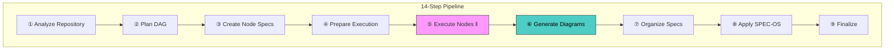

# 🔬 spec-zero-lite

**Intelligent Repository Analyzer** — Autonomously generates comprehensive technical documentation using a modular agentic orchestration system.

[]()
[]()
[]()

---

## ✨ What It Does

Point spec-zero-lite at any repository and it produces:

- **15+ analysis documents** covering architecture, dependencies, APIs, security, performance, and more
- **Mermaid diagrams** — architecture, data flows, sequences, ER, class hierarchies, deployment
- **SPEC-OS formatted output** — ready for Obsidian vault integration
- **Complete audit trail** — structured JSON logging, state persistence, and resumability

## 🏗️ Architecture



**Key Paradigm**: Shifting from algorithmic (hardcoded logic) to **agentic** (LLM agent-based) problem solving — specifying *what* to do rather than writing code that *knows* what to do.

## 🚀 Quick Start

### Prerequisites

- [OpenCode AI](https://opencode.ai) installed and configured
- Node.js 18+ (for TypeScript skills)
- Python 3.8+ (for utility scripts)

### Run an Analysis

```bash
# In OpenCode, start the orchestrator
/agent orchestrator

# Launch analysis on a target repository
/start /path/to/target-repo
```

The orchestrator will:
1. Ask for an output directory
2. Create an isolated analysis project
3. Run all 14 steps automatically
4. Deliver organized specifications + Mermaid diagrams

### Output Structure

```
{output_path}/{repo_name}-{date}/
├── _session/                    # Session metadata
├── _meta/                       # DAG, node specs, cache, logs
├── _generated/                  # Raw analysis output
│   ├── node-001-bootstrap.md
│   ├── node-002-dependencies.md
│   ├── ...
│   └── diagrams/                # Mermaid diagrams
│       ├── architecture-overview.md
│       ├── data-flow.md
│       ├── dependency-graph.md
│       ├── sequence-main-flow.md
│       ├── class-hierarchy.md
│       ├── deployment.md
│       └── _diagrams-index.md
├── {repo_name}-Specs/           # Organized, SPEC-OS adapted
│   └── 00-INDEX.md
└── ANALYSIS-SUMMARY.md
```

## 🤖 Agents

| Agent | Role |
|-------|------|
| **orchestrator** | Coordinates entire 14-step pipeline |
| **analyzer** | Initial repository analysis and tech stack detection |
| **dag-planner** | Creates dependency graph with adaptive node counts |
| **node-creator** | Generates node specifications with diagram requirements |
| **generic-executor** | Executes nodes with context injection and Mermaid generation |
| **standard-analyzer** | Modular analyzer for parameterized tasks |
| **documentation-writer** | Formats raw analysis into polished documents |
| **diagram-generator** | Generates Mermaid diagrams (architecture, sequence, ER, flows) |
| **spec-organizer** | Organizes specs into adaptive modular structure |
| **spec-os-adapter** | Applies SPEC-OS conventions (UIDs, frontmatter, Obsidian links) |
| **spec-git-manager** | Manages git submodules and spec synchronization |
| **logging-manager** | Structured logging, telemetry, and session summaries |

## 📊 Diagram Generation

Every analysis produces **6 mandatory Mermaid diagrams** plus conditional diagrams based on repository type:

| Diagram | Type | When |
|---------|------|------|
| Architecture Overview | `graph TD` | Always |
| Data Flow | `flowchart LR` | Always |
| Dependency Graph | `graph TD` | Always |
| Main Flow Sequence | `sequenceDiagram` | Always |
| Class Hierarchy | `classDiagram` | Always |
| Deployment | `graph TD` | Always |
| Component Tree | `graph TD` | Frontend repos |
| API Sequence | `sequenceDiagram` | API repos |
| ER Diagram | `erDiagram` | Database repos |
| Auth Flow | `sequenceDiagram` | If auth present |
| Package Dependency | `graph TD` | Monorepos |

## ⚙️ Configuration

Configuration in `.opencode/config.yaml`:

```yaml
# Key settings
execution:
  max_concurrent_nodes: 3
  node_timeout_seconds: 300
  max_retries: 2

diagrams:
  enabled: true
  format: "mermaid"
  theme: "default"
  max_nodes_per_diagram: 30

analysis:
  adaptive_nodes: true    # 8-20 nodes based on repo size
```

## 📁 Project Structure

```
spec-zero-lite/
├── opencode.json                # Agent definitions
├── CLAUDE.md                    # AI assistant instructions
├── QUICKSTART.md                # Quick start guide
└── .opencode/
    ├── config.yaml              # Pipeline configuration
    ├── specs-register.json      # Spec submodule registry
    ├── prompt/                  # Agent prompts (12 files)
    │   ├── orchestrator-main.md
    │   ├── step1-analyzer.md
    │   ├── step2-dag-planner.md
    │   ├── step3-node-creator.md
    │   ├── step5-generic-executor.md
    │   ├── step6-diagram-generator.md
    │   ├── step7-spec-organizer.md
    │   ├── step8-spec-os-adapter.md
    │   ├── step11-spec-git-manager.md
    │   ├── documentation-writer.md
    │   ├── standard-analyzer-base.md
    │   └── logging-manager.md
    ├── template/type/           # Output templates
    ├── skill/                   # TypeScript/Python skills
    └── models.md                # Model selection strategy
```

## 🔧 Customization

- **Add analysis nodes**: Edit `step2-dag-planner.md` and `step3-node-creator.md`
- **Change diagram types**: Edit `step6-diagram-generator.md` and `config.yaml`
- **Add templates**: Create new `.template.md` files in `.opencode/template/type/`
- **Custom skills**: Add `.ts` or `.py` scripts in `.opencode/skill/`
- **Adjust models**: Modify agent model assignments in `opencode.json`

## 📝 License

MIT

---

Built with ❤️ using [OpenCode AI](https://opencode.ai)
